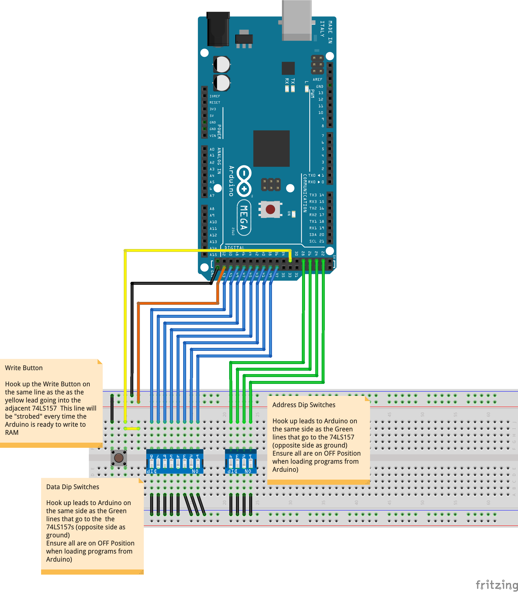
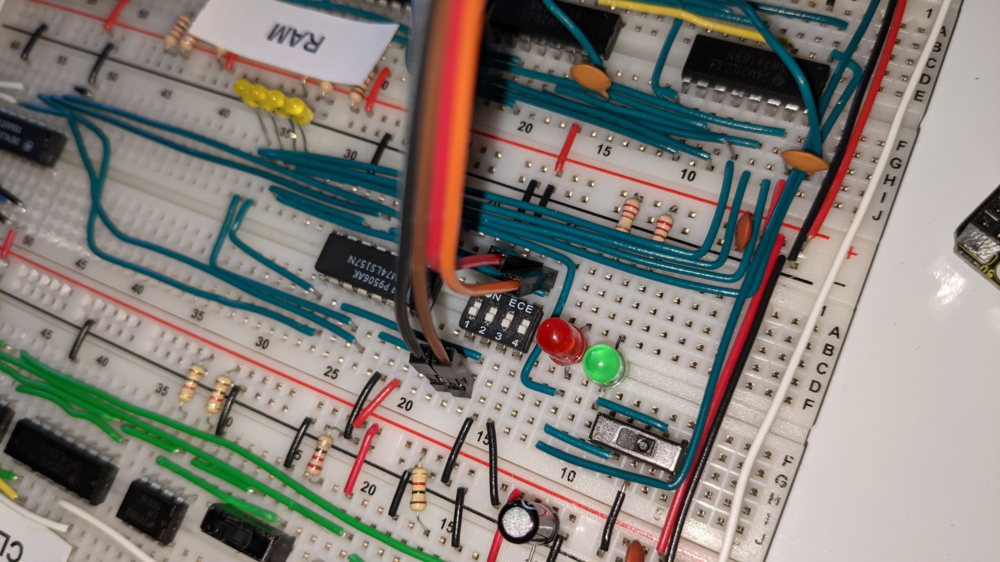
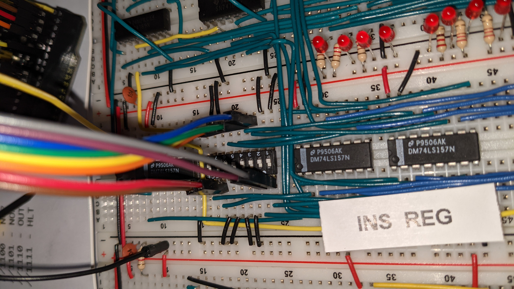
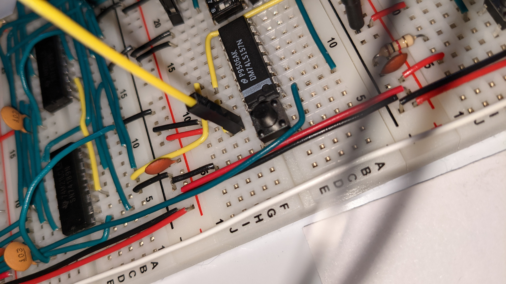

# BE SAP1 Program Loader

This mini project is really just to explain to people who want to know what I did how I did the thing I did so that they might do the thing I did but only do it in a way that's better and more elegant becuase this thing isn't really a thing at all yet.  Well it does work, but it's not a "thing".

## DIP Switches are fun and all but...

While it's fun to use the dips to load the 16 line machine code, it gets old pretty quick. I wanted a way to quickly restore a couple of known programs into RAM without all the hassle of dips.  Expecially because the DIPS I eneded up using require a surgically precise needle to be able to use them.

## Hookup instructions

There is a Fritzing thing available in this repo - here is the exported image.  It's just to show the basic hook ups and is not meant to accurately represent the BE-SAP1.

[Fritzing Project](BE-SAP-1-ArduinoMegaProgramLoader.fzz)

### Address Lines

Connect the 4 address lines (pins 22, 24, 26, 28) to the address 4-DIP switch so that they are on the opposite side of the switch as whereever you hooked up ground.  I think I might have drifted sligthly in terms of the arrangement of my dips vs Ben's schematic.  Here is what mine looks like.  Use the Fritzing Diagram to know which pins to hook up to which DIPS.

### Data Lines

Connect the 8 data lines (pins 38, 40, 42, 44, 46, 48, 50, 52) to the data 8-DIP switch so that they are on the opposite side of the switch as whereever you hooked up ground.  Mine might be different to yours.  Here is a picture of how mine looks.  Use the Fritzing diagram to know which pins to hook up to which DIPS.

### Save to RAM Button

Hook up pin 32 on the Arduino to the write to ram button on the same line that goes into the 74LS157.  Like this:

### Program Select Line

My Arduino sketch has two programs saved in it and this line is used to select which one to load.  Just tie pin 53 to either 5 volts or ground.

### Common Ground

Hook up Ground on the mega to any ground rail on the BE-SAP1.

## Running the program loader

[Arduino Sketch](SAP1-Loader.ino)

I have found that these steps need to be done in the correct sequence for it to work.  In future we could look at using the Arduino to disable things like the clock and the Microcode EEPROMS but for now I am doing it manually.

* Stop the clock.
* Smash that RESET button.
* Slide on over to Program Mode
* IMPORTANT: Make sure all dips are in the UP / OFF / OPEN position.  Remember these dips are upside down. So UP is off on the DIP - which is on on the board.  Confusing as hell.  Leave them open.  The arduino will send the signals for you.
* Upload the sketch to the Mega.  I have not used the serial interface so don't bother with it.
* The ram will be programmed automatically.  Watch the LEDs on the Memory Address Register.  They will quickly cycle through and stop at the end of your program.
* Slide on out of program mode.
* Smash that reset button again for good measure (probably not required)
* start the clock or step through - whatever you prefer.

### Changing the loaded program.

* Just move the SELECT Line (pin 53) from LOW to HIGH or vice-versa.

### It's not working

Yeah - this happens to me too.  Sometimes I just need to reprogram the board.  I just follow all the steps but instead of uploading the code from the Arduino IDE, I just hit the reset button on the mega.  Otherwise - it's all opensource and you can probably figure out how to make it all more stable.

## Future enhancments

### Use a nano

To use an Arduino Nano, we would need to use a shift register chip like the ones used on the eeprom programmer or even the more convenient 74LS164 (or 74HC164) to shift the data bits in.  That would free up enough lines to fit on the Nano.  I am going to order such a chip when I get round to it and hook it up that way.  We know how to shift data out of an Arduino because we all made an EEPROM programmer.
